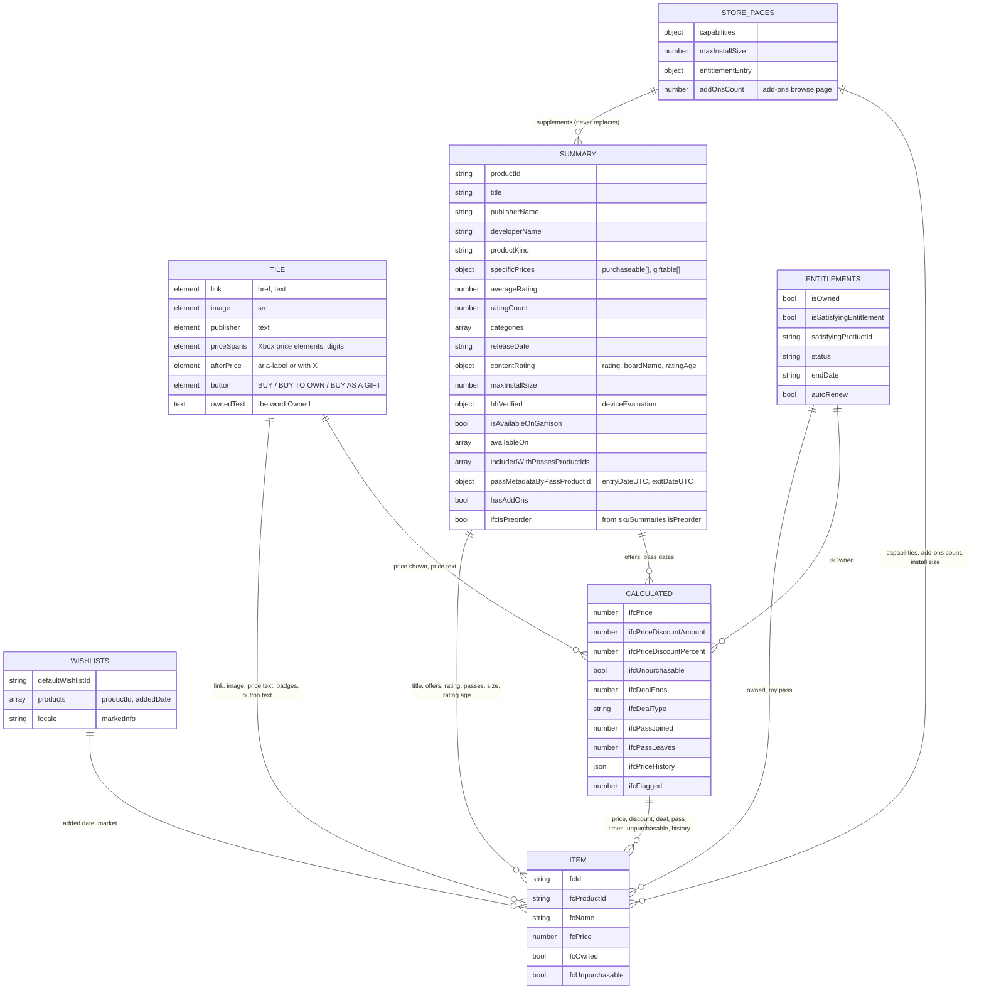

# Item data model - where every item attribute comes from

Written for T-54 (v1.5.26278.10). It describes how one wishlist **item** (a tile on the page, kept as
`data-ifc-*` attributes on its container) is assembled from six sources. It reflects the code in
`browser-extension/src/shared/xbox-wishlist.core.js`: `setContainerData()`, `setProductDataAttributes()`,
`productOfferFacts()`, `payloadPrices()`, `passTimeline()`, `applyStorePage()`.

## 1. The six sources

| # | Source | What it is | When it is read |
|---|---|---|---|
| 1 | Tile | The item's own markup on the page (DOM) | every screen update |
| 2 | Summary | `core2.products.productSummaries[id]` (+ `skuSummaries[id]`) in the wishlist page's embedded `__PRELOADED_STATE__` | page load; `loadProductData()` |
| 3 | Entitlements | `core2.products.entitlements[id].data` in the same state | page load |
| 4 | Wishlists | `core2.wishlist.wishlists[]` and `appContext.marketInfo` in the same state | page load |
| 5 | Load details / store pages | A game's own store page (same embedded state shape) and its add-ons browse page | on request: Load details, or an item's refresh button; cached 7 days |
| 6 | Calculated | Values we work out from the other five, or keep ourselves (flags, price history) | every screen update |

## 2. Relationship diagram

## 3. Tile - what is read from the markup

| Tile element (found by prefix, never by hashed name) | Item attribute | Used as |
|---|---|---|
| Details link inside the product details block: `href` | `ifcUri`, `ifcProductId` (the id after `/store/<slug>/`) | the only source of the id |
| same link: text | `ifcName` | fallback when the summary has no title |
| Image link `img`: `src` | `ifcImage` | only source |
| Publisher element (alt text, or a `p` in the details block): text | `ifcPublisher` | fallback when the summary has no publisher |
| Price elements (original price, listed discount price, bold text; else the first two `div span` of the details block): does one hold a digit? | `ifcPriceShownFor` | **authority on whether the page shows a price to this viewer** |
| same elements: the number | `ifcPriceBase`, `ifcPriceDiscount` | fallback when the summary has no usable offer, or the tile shows no price |
| After-price area: child `aria-label`s, else text `with X` | `ifcSubscriptions` | only source (not in the data) |
| First button text and the word "Owned" in the item | `ifcOwned` | fallback only when the page has no entitlements (English only) |

Our own elements inside the tile (`ifc-*`: chips, badges, buttons) are skipped when reading price text
(`tilePriceSpans()`, v1.5.26278.8). Before that, a chip such as "94 GB" was read as a price.

## 4. Summary - Xbox's product record on the wishlist page

All properties present in the saved wishlist captures, and what the item takes from each:

| Summary property | Item attribute | How |
|---|---|---|
| `title` | `ifcName` | trimmed; tile text is the fallback |
| `publisherName` | `ifcPublisher` | trimmed; tile is the fallback |
| `developerName` | `ifcDeveloper` | as is |
| `productKind` | `ifcType` | Game / DLC (Durable) / Consumable (English labels) |
| `specificPrices.purchaseable[]` | `ifcPriceBase`, `ifcPriceDiscount`, `ifcPrice` | lowest `listPrice` among offers not marked Remediation; `listPrice < msrp` means discounted (base = msrp, discount = listPrice); **only when the tile shows a price** |
| offers: `discountPercentage`, `endDateUtc` | `ifcDealEnds` | the biggest current discount's end date (UTC, future only; far-future placeholders ignored); only when the tile shows a discount |
| offers: `eligibilityInfo`, `hasXPriceOffer` | `ifcDealType`, `ifcDealReason` | personal (Just for you) beats public sale beats member price |
| `averageRating`, `ratingCount` | `ifcRating`, `ifcRatingCount` | rating only when `ratingCount > 0` |
| `categories` | `ifcGenres` | JSON list |
| `releaseDate` | `ifcReleaseDate` | parsed to a timestamp |
| `contentRating.rating`, `.boardName`, `.ratingAge` | `ifcAgeRating`, `ifcMinAge` | board name + rating text; minimum age number |
| `maxInstallSize` | `ifcInstallSize` | bytes; 0 on the wishlist page, so the cached store-page value is used |
| `hhVerified.deviceEvaluation` | `ifcHandheldOptimized` | true when it equals 1 |
| `isAvailableOnGarrison` | `ifcXboxPcApp` | true when exactly true |
| `availableOn[]` | `ifcPlatforms` | JSON list of English labels |
| `includedWithPassesProductIds[]` | `ifcInPass` | non-empty |
| `includedWithPassesProductIds[]`, `passMetadataByPassProductId{}` | `ifcPassJoined`, `ifcPassLeaves` | see Calculated |
| `hasAddOns` | `ifcHasAddOns` | true unless a loaded add-ons count says 0 |
| `skuSummaries[id][sku].isPreorder` (kept as `ifcIsPreorder`) | `ifcPreorder` | any edition is a pre-order |
| `productId` | (key) | the map key |

Present in the data but not used: `badges`, `cmsVideos`, `description`, `shortDescription`, `images`, `videos`,
`optimalSkuId`, `preferredSkuId`, `optimalSatisfyingPassId`, `productFamily`,
`showSupportedLanguageDisclaimer`, `hasUbisoftCrossEntitlementProduct`; offer fields `skuId`, `availabilityId`,
`availabilityActions`, `currency` (read only to name the page currency), `xPriceOfferInfo`; content rating
`description`, `disclaimers`, `descriptors`, `imageUri`, `imageLinkUri`, `interactiveDescriptions`,
`ratingDescription`.

## 5. Entitlements - what the viewer owns

`core2.products.entitlements[id].data`: `productId`, `skuId`, `autoRenew`, `isOwned`, `isSatisfyingEntitlement`,
`isTrial`, `status`, `satisfyingProductId`, `endDate`.

| Entitlement property | Item attribute | How |
|---|---|---|
| `isOwned` | `ifcOwned` | **primary**; missing entry means not owned; the tile is used only when the page has no entitlements at all |
| `isSatisfyingEntitlement`, `satisfyingProductId`, `status`, `endDate`, not `isOwned` | `ifcInMyPass`, `ifcMyPassEnds` | covered by a pass: satisfying entry, status Active, end date in the future |
| `autoRenew` | (chip text) | "renews" or "until" on the In your pass chip |
| `skuId`, `isTrial`, `productId` | not used | |

## 6. Wishlists

| Property | Item attribute | How |
|---|---|---|
| `core2.wishlist.wishlists[].products[].addedDate` (default wishlist, else the first) | `ifcAddedDate` | timestamp; only the wishlist page has it, a store page does not |
| `appContext.marketInfo.locale` | (page setting) | locale for price formatting, per-market storage |
| first offer's `currency` | (page setting) | the page currency; price ranges are saved per currency |
| `wishlists[].id`, `isDefault`, `name`, `settings`, `giftingString`, `products[].skuId`, `actions` | not used | |

## 7. Load details / store pages

| Read | Gives | Item attribute | How it is used |
|---|---|---|---|
| The game's store page summary | `capabilities` | `ifcCapabilities`, `ifcDetailsLoaded` | cached per product for 7 days |
| same | `maxInstallSize` | `ifcInstallSize` | the wishlist page's value is 0; cached |
| same | other fields (`editions`, `bundledProductIds`, `languagesSupported`, `systemRequirements`, ...) | none | merged into the record, not used |
| The game's add-ons browse page (`ProductAddOns_<ID>`) | a total count | `ifcAddOnsCount` | cached with the capabilities |
| The store page's entitlement entry | an updated entry | `ifcOwned`, `ifcInMyPass` | replaces the entry; a missing entry changes nothing |

**Merge rule (T-54).** A store page's summary has every field the wishlist's has plus more, but it is a different
page and its values can differ (for the same game the saved captures differ in `maxInstallSize`, `contentRating`
descriptors, `images`, and the order of `availableOn`). It never replaces the record:
- Load details (`'supplement'`): fills only fields the wishlist record lacks or has empty (0, "", [], null, {}).
- The item's refresh button (`'refresh'`): the store page's values win, but no field is lost.
- Test: the harness's "details stability" check applies a fake store page to every item and fails if any item's
  red / owned / price changes (all 46 fixtures, 0 changed).

## 8. Calculated

| Item attribute | Calculation | Inputs |
|---|---|---|
| `ifcId` | page-order number | tile order |
| `ifcPriceShownFor` | tile shows a price (set once, re-looked at every cycle if not) | tile |
| `ifcPriceBase`, `ifcPriceDiscount` | summary offers when the tile shows a price, else the tile's own numbers | summary, tile |
| `ifcPrice` | `ifcPriceDiscount ?? ifcPriceBase` | the two above |
| `ifcPriceDiscountAmount`, `ifcPriceDiscountPercent` | `base - discount`, and that as a rounded percent; 0 when not discounted | base, discount |
| `ifcOwned` | entitlement `isOwned`, else tile text | entitlements, tile |
| `ifcUnpurchasable` | **not owned and `ifcPrice` is null**, i.e. the page shows no price to this viewer | owned, price |
| `ifcDealEnds`, `ifcDealType`, `ifcDealReason` | from the offers, only for deals the page shows | summary, price |
| `ifcPassJoined` | earliest current pass start, only if every current start is known | summary |
| `ifcPassLeaves` | latest end, only if every current stint has an announced end | summary |
| `ifcInPass` | pass list not empty | summary |
| `ifcInMyPass`, `ifcMyPassEnds` | pass entitlement active and in date | entitlements |
| `ifcHasAddOns`, `ifcAddOnsCount` | `hasAddOns` flag and not a loaded count of 0; count from the add-ons page | summary, store pages |
| `ifcAgeRating` | board name + rating text (board name omitted when the text already starts with it) | summary |
| `ifcCapabilities` | store page capabilities, whitespace collapsed | store pages |
| `ifcPriceWas`, `ifcPriceChanged`, `ifcDealSince`, `ifcDealSinceKnown`, `ifcPriceLow`, `ifcPriceHistory` | our own record per product and market, written once per visit from `ifcPrice` | price, storage |
| `ifcFlagged` | in our flags list | storage |
| "Added recently", "Leaving pass soon", "New in pass" | computed at read time from `ifcAddedDate`, `ifcPassLeaves`, `ifcPassJoined` (30 days) | the dates |

## 9. Rules and known limits

1. **The tile decides whether a price is shown.** Checked across 17 wishlist captures: the data has a priced offer
   for 3 to 4 items per capture that the tile shows no price for (owned items, and pre-orders). Those are Xbox's
   own display decisions, so Un-Purchasable stays tile-based; the data cannot reproduce it.
2. **Data first, tile second** for title, publisher, price, owned. The tile is the fallback only.
3. **A store page never replaces the wishlist record** (section 7).
4. **One price derivation**: `ifcPrice` only. The unused `ifcStatePrice` / `ifcStateMsrp` were removed (T-54).
5. **English-only fallbacks, kept on purpose:** owned from tile text (only when the page has no entitlements) and
   subscriptions from `with X` (only when no `aria-label` exists). The data has no replacement for either.
6. **English display labels** (platforms, item type, filter and UI texts) are T-26.
7. The older, shorter field list is `docs/07-DATA-FIELDS.md`; this file supersedes it for attribute sources.
